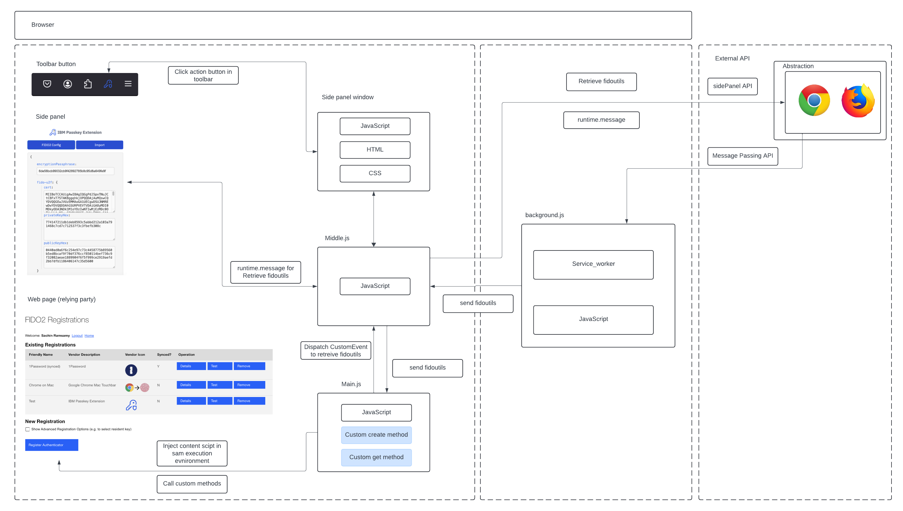

### Software Design Architecutre

The architecture of the extension is structured to handle FIDO2 registration and authentication efficiently across multiple contexts. Below is a visual representation of how the service worker, content scripts, and message-passing mechanisms work together to ensure smooth communication and functionality.



As shown in the diagram, the service worker handles background tasks, while the content scripts interact with the webpage's DOM and facilitate data exchange between the extension and the relying party.

### Differences Between Chrome and Firefox Manifest Files

The initial step in building a browser extension is defining its configuration through the manifest.json file. Every extension requires this file in its root directory, which outlines key details about the extension’s structure and behavior. It serves as a blueprint, describing the features and capabilities the extension can support.

=== "Chrome"

    ``` json
    "manifest_version": 3,
    "name": "IBM Passkey Extension",
    "version": "1.0",

    "description": "Performs FIDO2 registration and authentication ceremonies",
    "homepage_url": "https://github.com/sramsamy/fido2-browser-extension",
    "icons": {
    	"48": "icons/ibm-cloud--hyper-protect-crypto-services-48x48.png",
    	"96": "icons/ibm-cloud--hyper-protect-crypto-services-96x96.png"
    },

    "permissions": ["activeTab", "storage", "sidePanel", "notifications"],
    "side_panel": {
    	"default_path": "side_panel.html"
    },

    "action": {
    	"default_icon": "icons/ibm-cloud--hyper-protect-crypto-services-48x48.png",
    	"default_title": "FIDO2"
    },
    "background": {
    	"service_worker": "background_script.js"
    },

    "content_scripts": [
    	{
    		"matches": ["https://*/*"],
    		"js": ["main.js"],
    		"world": "MAIN",
    		"run_at": "document_start"
    	},
    	{
    		"matches": ["https://*/*"],
    		"js": ["middle.js"],
    		"run_at": "document_start"
    	}
    ],
    "externally_connectable": {
    	"matches": ["https://*/*"]
    }
    ```

=== "Firefox"

    ``` json
    "manifest_version": 3,
    "name": "IBM Passkey Extension",
    "version": "1.0",
    "description": "Performs FIDO2 registration and authentication ceremonies",
    "homepage_url": "https://github.com/sramsamy/fido2-browser-extension",
    "icons": {
    	"48": "icons/ibm-cloud--hyper-protect-crypto-services-48x48.png",
    	"96": "icons/ibm-cloud--hyper-protect-crypto-services-96x96.png"
    },

    "permissions": ["activeTab", "storage", "notifications", "scripting", "tabs"],
    "sidebar_action": {
    	"default_icon": {
    		"48": "icons/ibm-cloud--hyper-protect-crypto-services-48x48.png",
    		"96": "icons/ibm-cloud--hyper-protect-crypto-services-96x96.png"
    	},
    	"default_title": "",
    	"default_panel": "side_panel.html",
    	"open_at_install": false
    },

    "action": {
    	"default_icon": "icons/ibm-cloud--hyper-protect-crypto-services-48x48.png",
    	"default_title": "Open Sidebar"
    },
    "background": {
    	"scripts": ["background_script.js"]
    },

    "content_scripts": [
    	{
    		"matches": ["<all_urls>"],
    		"js": ["main.js"],
    		"world": "MAIN",
    		"run_at": "document_start",
    		"all_frames": true
    	},
    	{
    		"matches": ["<all_urls>"],
    		"js": ["middle.js"],
    		"run_at": "document_start"
    	}
    ],
    "content_security_policy": {
    	"extension_pages": "script-src 'self' 'wasm-unsafe-eval'; object-src 'self'"
    },

    "host_permissions": ["https://*/*", "http://*/*"],
    "web_accessible_resources": [
    	{
    		"resources": ["main.js"],
    		"matches": ["<all_urls>"]
    	}
    ]
    ```

#### Service Worker

The service worker operates in a special context known as the background page, which provides access to a `window` global object and standard DOM APIs. Additionally, it can access any WebExtension APIs. However, service workers cannot directly interact with web pages. Instead, communication between the service worker and content scripts is done through a message-passing API.

For more details on service workers, refer to the [MDN Web Docs on Background Scripts](https://developer.mozilla.org/en-US/docs/Mozilla/Add-ons/WebExtensions/Background_scripts).

In this extension, the service worker is crucial as it generates attestation keys for various attestation types. Currently, only the `none` attestation type is supported. In the future, the extension will support `fido-u2f`, `packed`, `tpm`, and `packed-self` attestation types. The service worker handles all requests for attestation keys, set in the `fidoUtilsConfig` object, from content scripts, relying on message-passing for communication.

#### Content Scripts

Content scripts execute in a special environment known as an `isolated world`, allowing them to interact with the DOM of the relying party's webpage but preventing direct access to any JavaScript variables or functions created by the webpage.

To bypass this limitation, the extension uses two content scripts:

1. `main.js` runs in the "MAIN" world, meaning it shares the same execution environment as the relying party's JavaScript. This allows it to interact with the page’s JavaScript, but at the cost of losing access to WebExtension APIs such as `browser.runtime`.
2. `middle.js`, on the other hand, remains in the default ``"ISOLATED"` world, acting as a bridge between `main.js` and the service worker.

#### Communication Between Scripts

To facilitate communication between these scripts, the extension uses two message-passing methods:

- **Custom Events**: Since `main.js` and `middle.js` both share the DOM, they communicate via custom events using JavaScript’s `CustomEvent` interface. For example, when a user clicks the **register** button, it intercepts `navigator.credentials.create` and triggers a custom method. This method retrieves the `fidoUtilsConfig` object from the background service, passing it from the service worker to `middle.js` and finally to `main.js`.

- **Message Passing**: For communication between `middle.js` and the service worker, the extension relies on the WebExtension and Chrome message-passing API to relay requests and responses between the scripts.

To manage the differences between the Chrome and Firefox browser APIs, the extension uses an abstraction class called `BrowserApi`. This class helps streamline the interactions with the distinct APIs provided by Chrome and Firefox, allowing the extension to work across both browsers without duplicating code.

```javascript title="middle.js"
class BrowserApi {
	static isChromeApi = navigator.userAgent.includes("Chrome");
	static isFirefoxApi = navigator.userAgent.includes("Firefox");

	static get runtime() {
		return this.isChromeApi ? chrome.runtime : browser.runtime;
	}

	static get sidePanel() {
		if (this.isChromeApi) {
			return chrome.sidePanel;
		} else if (this.isFirefoxApi) {
			return browser.sidebarAction;
		}
		return null;
	}
}
```

This setup ensures efficient communication between all parts of the extension, allowing it to handle FIDO2 registration and authentication operations.

#### Dispatching a Custom Event

### Dispatching a Custom Event

Since `main.js` loses access to the Browsers `runtime` API, Custom events are a handy way to communicate between different components of the extension, especially when dealing with message-passing between content scripts and background scripts. In our extension, we use the `CustomEvent` interface to dispatch events containing specific messages or data.

The first step is to dispatch a `CustomEvent` containing the necessary message. This method is used in several places, including the `requestFidoUtilsConfig()` function, which requests the FIDO2 configuration from the background script.

```javascript title="main.js"
document.dispatchEvent(
	new CustomEvent("requestFidoUtilsConfig", {
		detail: {
			title: "getFidoUtils",
			message: "Retrieve fidoutilsConfig variable",
		},
	})
);
```

`middle.js` then listens for the event dispatched from main.js and communicates with the background service worker using the browser.runtime API.

```javascript title="middle.js"
document.addEventListener("requestFidoUtilsConfig", async function (e) {
    let data = e.detail;
    const response = await BrowserApi.runtime.sendMessage({
        message: "Retrieve fidoutilsConfig variable",
    });
```

The background service worker listens for incoming messages from the content scripts. Upon receiving a request, it retrieves the fidoutilsConfig object and sends it back to `middle.js` through a callback function. The following code snippet demonstrates this process:

```javascript title="background_script.js"
fido.BrowserApi.runtime.onMessage.addListener(
	function (request, sender, sendResponse) {
		if (request.message === "Retrieve fidoutilsConfig variable") {
			console.log("Received request for the fidoutilsConfig object");
			const config = getFidoUtilsConfig();
			sendResponse({ result: config });
			return true;
		}
	}
);
```

After receiving the response from the background script, middle.js dispatches a custom event to main.js. This custom event contains the fidoutilsConfig object within the CustomEvent.detail property.

```javascript title="middle.js"
document.dispatchEvent(
	new CustomEvent("setFidoUtilsConfig", {
		detail: {
			title: "Response",
			message: "Sending fidoutilsConfig to main.js",
			response: response,
		},
	})
);
```

In the requestFidoUtilsConfig function within main.js, an event listener is set up to listen for responses from middle.js. This function returns a promise that, when fulfilled, sets the fidoutilsConfig variable with the object received from middle.js.

```javascript title="middle.js"
function handleConfigResponse(e) {
	if (e.detail && e.detail.response.result) {
		resolve(e.detail.response.result);
	} else {
		reject("Failed to retrieve fidoutilsConfig");
	}
	document.removeEventListener("setFidoUtilsConfig", handleConfigResponse);
}
```

### FIDO2 Config

Upon installing the extension for this first time, an adaption of Shane Weedens `fido2-node-client` script, which can be viewed [here](https://github.com/sbweeden/fido2-node-clients/blob/main/certs/generate_attestation_certs.js), generates a set of attestation keys for various attestation types are generated with various cryptographic keys and certificates that are essential for FIDO2 attestation. The extension creates a self-signed Certificate Authority (CA) and signs certificates for different attestation types Additionally, it outputs a JSON configuration parameter that is essential for this extension, enabling it to perform FIDO2 registration and authentication ceremonies.

The different attestation types include:

- `U2F`
- `Packed`
- `Packed-self`
- `TPM`

This code snippet below checks if a U2F attestation key already exists in the storage. If it doesn't, it creates a new key pair using the `jsrasign` library and converts the public and private keys to PEM format, storing the private key for future use.

```javascript
let u2fPublicKeyPEM = null;
let u2fPrivateKeyPEM = null;
if (!store[U2F_ATTESTATION_KEY]) {
	console.log("Creating U2F key: " + U2F_ATTESTATION_KEY);
	let kp = jsrsasign.KEYUTIL.generateKeypair("EC", "secp256r1");
	u2fPublicKeyPEM = jsrsasign.KEYUTIL.getPEM(kp.pubKeyObj, "PKCS8PUB");
	u2fPrivateKeyPEM = jsrsasign.KEYUTIL.getPEM(kp.prvKeyObj, "PKCS8PRV");
	store[U2F_ATTESTATION_KEY] = u2fPrivateKeyPEM;
} else {
	// Retrieve the existing U2F private key PEM and extract the public key
	u2fPrivateKeyPEM = store[U2F_ATTESTATION_KEY];
	let prvKey = jsrsasign.KEYUTIL.getKey(u2fPrivateKeyPEM);
	u2fPublicKeyPEM = fidoutils.certToPEM(
		jsrsasign.b64toBA(jsrsasign.hextob64(prvKey.pubKeyHex))
	);
}
```

Attestation is optional in FIDO authentication, and currently this extension is defaulted to `packed-self` when a user generates a passkey. Future versions of the IBM passkey extension should add support for other formats to meet the FIDO Alliance's Metadata Service (MDS) and provide proof that the authenticator meets the RP's criteria. For more information on FIDO attestation, see this [FIDO White Paper](https://fidoalliance.org/fido-attestation-enhancing-trust-privacy-and-interoperability-in-passwordless-authentication/#fido-attestation-explained).

An example of the `FIDO2_CONFIG` object:

```javascript
let exampleConfig = {
	encryptionPassphrase: "MySecret",

	origin: "https://example.ibm.com:9443",

	"fido-u2f": {
		privateKeyHex:
			"00b8464b082d2a77bae48d8ec84694cd4cca7b41948635622a8db1bc87a8894f17",
		publicKeyHex:
			"04ffd1d9a70f7c1c83fa8660925dfbfcbb4d1c232e5443f5d9ee4ad72480fec9d20068c05b5d7777cc25fd27d93015c0ea2d72f51d8eae1970729b98609a5013db",
		cert: "MIIDFjCB/wIJAKiWRVc805iDMA0GCSqGSIb3DQEBCwUAMDExCzAJBgNVBAYTAlVTMQ0wCwYDVQQKDAROSVNUMRMwEQYDVQQDDApVSUNDUm9vdENBMB4XDTE5MDgwNzIwMjgwM1oXDTQ2MTIyMjIwMjgwM1owNTELMAkGA1UEBhMCVVMxDTALBgNVBAoMBE5JU1QxFzAVBgNVBAMMDlVJQ0NVMkYtU0lHTkVSMFkwEwYHKoZIzj0CAQYIKoZIzj0DAQcDQgAE/9HZpw98HIP6hmCSXfv8u00cIy5UQ/XZ7krXJID+ydIAaMBbXXd3zCX9J9kwFcDqLXL1HY6uGXBym5hgmlAT2zANBgkqhkiG9w0BAQsFAAOCAgEAKP/Ck24JM+8J7Ns4g5a8XczXPPnYe+FFs7bUQoam2sEEPBzapdIssl9rYkFKvxIW8zgPHJVIQJ3hMmq9tGkhKXT+WzIew+BJRzBYscytaaqMURHuqM1usBFQZSBUYIlDCQqezxG9bZ4cx8gzmL4ldYPGwSAex3K9XOVdyNn+ut8/axcfhDYfr0zW498KOg1L72kjthiNTrJWGaCwkfCsNNtBHWy2HmGzAgMLi7Wn3eNzTyrbzj7GBBsFm6Nv5LKLxCwX8YEd6UWzYLuP/AhAG1+w1rfPmbdi0/hXGUr8h51dlTF2DUrxQfZvECA5Du4TZHHKpTu7opI2BSVabXYp+F25RbkcE1oAqjrZeMdeWXFu5bcD5MvQ6Q3D/M1H1ngahFLzyzPprZ1OO5codyiRwhPtSyeR+FIi7yj9Lirxhv+t1pzm9N6z8DEW3Iman5+x+hGPP01n0RFP1H+Fu0jUCZfcZmx0ecrrd2r3B0YpyUR5n45dweBw+dyQZaPm0eenyMYFNuXWNx+aT7wcYFYhoYEqi0n7bGmvR3ZmFws3rBi2uLOamM1cOSnabOQ7Tvirq39TAbJ3dNZAwoD7pFn4YZHeywPGlENnij1bMnTYyVXRr/coi84bD4S147Ydm6lWpMcolpVlplbXJ3S3BDu/AqJGBqQwKtBUDuL0BbnbE+0=",
	},

	packed: {
		aaguid: "37c4c2cf41544c5791039c9bdcca5b2b",
		privateKeyHex:
			"03e158d202854c3bc0cb233a726f4445b41b4ca80b370a2c30d8fe039f820d42",
		publicKeyHex:
			"045c6c82d6b47e2971a78ebbe8dd910ebbdcecb902019e6b37f743374c5740d9f0533068c562ebd7c11e55258b235efc48aba0d77f6d0ebe6f991321976ea1e072",
		cert: "MIIDVTCCAT2gAwIBAgIJAKiWRVc805iEMA0GCSqGSIb3DQEBCwUAMDExCzAJBgNVBAYTAlVTMQ0wCwYDVQQKDAROSVNUMRMwEQYDVQQDDApVSUNDUm9vdENBMB4XDTE5MDgwNzIwMjgwM1oXDTQ2MTIyMjIwMjgwM1owXDELMAkGA1UEBhMCVVMxDTALBgNVBAoMBE5JU1QxIjAgBgNVBAsMGUF1dGhlbnRpY2F0b3IgQXR0ZXN0YXRpb24xGjAYBgNVBAMMEVVJQ0NQQUNLRUQtU0lHTkVSMFkwEwYHKoZIzj0CAQYIKoZIzj0DAQcDQgAEXGyC1rR+KXGnjrvo3ZEOu9zsuQIBnms390M3TFdA2fBTMGjFYuvXwR5VJYsjXvxIq6DXf20Ovm+ZEyGXbqHgcqMQMA4wDAYDVR0TAQH/BAIwADANBgkqhkiG9w0BAQsFAAOCAgEAtsJl2cVtuRJqwm0SXhP2vGU3An79GxT1appa9JKLWz7iv5zOVWowKvbEnB6sqjNPZ1p65yEi5UmRNnkE6m6IFSRijz5eeWOHQ0ceQN4BhH9veE4Xe3WiOaahTTJX+hqj+5ByMhgw0dZ6+1iEu20BE0zKAA+VSrpA5O+LPOBDNjCfVzLI566ykNqe2mShm+UGNDYkTxVJmFXY9qyy/zLazynroE6qnIt03UutzifAnNNnBKqk9gK9C6cosDHeyvRGy9um1P21EC85yEZvN8wngzNmc8TJwnkXYHP4METHbjR9bmQP60e19a7so9sz7P5MhkFJ/JOURkbWh6qmzIGQhoNpGw6OQnAxHvkPiw9HuDEfjzIFX1LQi74uMIEG7juCIt2u56dXG7T0NM8MfVlupDJzi4AnwI+NuONrKtC5iK6HHSrRxCQ8QiPTemlymPhC/XMJW70PqDiH7cEmCbsDKg9cTN8mWCNNyb1/WkcfrP2zq+jm1Lp8Viam5kHsd66X9VP/44Aj5G6TGJU7ZitBB/hHqz0jznuZU+fRuGf2taQdCP/DXps/VngXrcvs4sRS3aid0KO5eLkUP8e11r909DMTvV/CsqghqXpS13oUbTs8cD12y93EftSbw6OKR30xcV1PScCOY/CSnCuSQFlgrXW1OotzmWQUKKKUB9Egzb8=",
	},

	"packed-self": {
		aaguid: "1811ec8b8a91459299f217f35d53242e",
	},
};
```

### Registering a Credential

The IBM passkey extension works by overriding the relying party's call to navigator.credentials.create(), a method from the WebAuthn API. This API, developed by [W3C](https://www.w3.org/TR/webauthn-2/) and [FIDO](https://fidoalliance.org/fido2-2/fido2-web-authentication-webauthn/), enables servers to use public key cryptography for FIDO2 registration and authentication.

When a user registers an authenticator, the server provides data that binds the user to a credential (a public-private key pair) along with identifying information. The extension intercepts the original navigator.credentials.create method using a reference to the original methods and then calls a custom implementation to handle the registration process.

```javascript title="main.js"
let myCredentials = {
	create: navigator.credentials.create.bind(navigator.credentials),
	get: navigator.credentials.get.bind(navigator.credentials),
};
```

The `createMethod` function is a custom implementation of `navigator.credentials.create()`, which is used to register new FIDO2 passkeys. When called, this method receives an `options` object, which contains data provided by the server to create a new credential for the user. This data includes:

- Challenge: A cryptographically random buffer generated by the server.
- Relying Party (rp) Object: Contains information about the server requesting the credential.
- User Object: Identifies the user for whom the credential is being created.
- PubKeyCredParams: Describes the cryptographic algorithms supported by the server.
- Authenticator Selection: Defines requirements for the authenticator type.
- Attestation Data: Optionally includes evidence of the authenticator’s trustworthiness.

```javascript title="main.js"
async function createMethod(options) {
	console.log("options object: ", options);
	try {
		const userPresence = await userPresenceModal(
			"Would you like to create a new passkey?"
		);
		console.log("user presence", userPresence);
		let oldFidoUtilsConfig = fido.getFidoUtilsConfig();
		let newFidoutilsConfig = await requestFidoUtilsConfig();
		// Set the origin in the config
		newFidoutilsConfig["origin"] = window.location.origin;
		// Set the fidoUtilsConfig object with the new one retrieved from the background script
		fido.setFidoUtilsConfig(newFidoutilsConfig);

		if ("publicKey" in options) {
			// Normalise the challenge field of the input to Uint8Array
			if (options.publicKey.challenge instanceof ArrayBuffer) {
				console.log("find me array buffer");
				options.publicKey.challenge = new Uint8Array(
					options.publicKey.challenge
				);
				console.log("new normalised challenge is", options.publicKey.challenge);
			}
			if (userPresence) {
				const result = await fido.processCredentialCreationOptions(
					options,
					"packed-self"
				);
				let publicCred = result.spkc;

				publicCred["getClientExtensionResults"] = function () {
					return {};
				};
				publicCred["toJSON"] = function () {
					return result;
				};

				publicCred.rawId = fido.base64toBA(
					fido.base64utobase64(publicCred.rawId)
				);

				publicCred.response.attestationObject = fido.base64toBA(
					fido.base64utobase64(publicCred.response.attestationObject)
				);

				publicCred.response.clientDataJSON = fido.base64toBA(
					fido.base64utobase64(publicCred.response.clientDataJSON)
				);

				showSuccessModal(
					"Custom create method successful. Creating new credential."
				);
				await new Promise((resolve) => setTimeout(resolve, 3000));
				return await publicCred;
			} else {
				return await myCredentials.create(options);
			}
			// else fallback to original create method
		} else {
			return await myCredentials.create(options);
		}
	} catch (error) {
		console.error("Error creating credential:", error);
		throw error;
	}
}
```

The method starts by checking whether the `challenge` in the `options` object is in the correct format. If the `challenge` is an `ArrayBuffer`, it is normalised into a `Uint8Array` to ensure proper handling during the credential creation process. The function then presents a user presence modal to request consent from the user to create a passkey. Once consent is granted, the function processes the credential creation options by invoking `fido.processCredentialCreationOptions`, which prepares a FIDO2 server public key credential. The resulting object contains the `publicKey`, which is used in future authentication, as well as other fields such as the `rawID`, `attestationObject`, and `clientDataJSON`. These fields provide cryptographic evidence of the registration.

```json title="publicKeyCredentialCreationOptions object"
{
	"publicKey": {
		"rp": {
			"id": "fidointerop.securitypoc.com",
			"name": "fidointerop.securitypoc.com"
		},
		"user": {
			"id": {
				"0": 185 ...
			},
			"name": "Sachin Ramsamy",
			"displayName": "Sachin Ramsamy"
		},
		"timeout": 300000,
		"challenge": {
			"0": 54 ...
		},
		"excludeCredentials": [
			{
				"id": {
					"0": 197 ...
				},
				"type": "public-key"
			}
		],
		"extensions": {},
		"authenticatorSelection": {
			"requireResidentKey": true,
			"userVerification": "preferred"
		},
		"attestation": "direct",
		"pubKeyCredParams": [
			{
				"alg": -7,
				"type": "public-key"
			}
		]
	}
}
```

Finally, the credential object is returned, with the necessary attributes for validating the registration, including methods to convert the object into a JSON format or retrieve client extension results. The server will then validate the credential by parsing the attestation object, client data JSON, and authenticator data. It will also ensure that the challenge matches the one originally sent and that the origin set in the extension matches the expected origin. This process ensures the integrity of the FIDO2 registration ceremony and verifies the authenticity of the newly created credential.

The publicKeyObject retrieved at the end is encoded using COSE, a compact format that describes the credential's public key and its associated metadata.

```javascript title="main.js | Weeden, S (2024) fido2-node-client [Source code] https://github.com/sbweeden/fido2-node-clients/blob/main/fidoutils.js "
let credPublicKeyCOSE = {
	1: 2, // kty
	3: -7, // alg
	"-1": 1, // crv
	"-2": jsrsasign.b64toBA(
		jsrsasign.hextob64(keypair.pubKeyObj.getPublicKeyXYHex()["x"])
	), // xCoordinate
	"-3": jsrsasign.b64toBA(
		jsrsasign.hextob64(keypair.pubKeyObj.getPublicKeyXYHex()["y"])
	), // yCoordinate
};
```

If the validation process is successful, the server stores the publicKeyBytes and credentialId in a database, linking them to the user's account. If the custom create implemention fails, then the extension will fall back to the original `navigator.credentials.create()` method.

### Authenticating with an IBM Passkey Extension Credential

After completing the registration step, the credential can be used to authenticate the user. During authentication, an assertion is created to prove that the user owns the private key associated with their registered credential. The extension overrides the original `navigator.credentials.get()` method, preparing a FIDO2 [`ServerAuthenticatorAssertionResponse`](https://fidoalliance.org/specs/fido-v2.0-rd-20180702/fido-server-v2.0-rd-20180702.html#serverauthenticatorassertionresponse) to serve as the parameters for the WebAuthn call. This custom method works by utlising one of Shane's [`fido2-node-client`](https://github.com/sbweeden/fido2-node-clients/blob/main/fidoutils.js) methods, `fido.processCredentialRequestOptions()`.

```json title="publicKeyCredential object"
{
	"publicKey": {
		"rpId": "fidointerop.securitypoc.com",
		"timeout": 300000,
		"challenge": {
			"0": 28 ...
				},
				"type": "public-key"
			}
		],
		"extensions": {
			"devicePubKey": {
				"attestation": "direct"
			}
		}
	}
```

The server generates a cryptographically random challenge, while the allowCredentials array specifies which credentials the server wants the user to authenticate with. The assertion object returned by the custom `get()` method is also a `publicKeyCredential` object but differs from the registration version. Instead of including the public key, it includes a signature. The `id` and `rawId` fields identify the credential used in the authentication, while `authenticatorData` contains information similar to registration data but without the public key. This data is also used to generate the signature. The `clientDataJSON` contains data passed from the browser to the authenticator, and this too is used in the signature generation process. The signature itself is generated by the private key tied to the credential, with the `fido.processCredentialRequestOptions()` method resolving the private key using the credential ID.

```json title="serverPublicKeyCredential object"
{
	"id": "U2FsdGVkX1_ymEkaxY69SeqRX1CPyA6abYNyenPDY-UWpmKOyXKx24K7buq-M_o8cfDYgROHcXQ7jEnMFpgCxtyquPjPYiQ3EyQc0aEC-QJVVC7BVYkT89fz9buA3mOe",
	"rawId": [
		83 ..
	],
	"response": {
		"clientDataJSON": [
			123 ..
		],
		"authenticatorData": [
			246 ..
		],
		"signature": [
			48 ...
		],
		"userHandle": ""
	},
	"type": "public-key"
}
```

In the extensions custom `get()` method, the server generates a challenge, and the method normalises this and other credential options (like `allowCredentials`) into `Uint8Array` format if they are of type `ArrayBuffer`. If the user consents to authenticate via the IBM passkey extension, the method uses fido.processCredentialRequestOptions() to create a serverPublicKeyCredential. The returned credential is formatted, converting fields like `authenticatorData`, `clientDataJSON`, `signature`, and `rawId` into binary form using `fido.base64toBA()`.

```javascript title="main.js"
async function myGetMethod(options) {
	try {
		const userPresence = await userPresenceModal(
			"Would you like to authenticate using the ibm passkey extension?"
		);
		if ("credentials" in navigator) {
			console.log("navigator.credentials", navigator.credentials);
			let fidoutilsConfigVariable = await requestFidoUtilsConfig();
			fidoutilsConfigVariable["origin"] = window.location.origin;
			fido.setFidoUtilsConfig(fidoutilsConfigVariable);
			if (options.publicKey.challenge instanceof ArrayBuffer) {
				options.publicKey.challenge = new Uint8Array(
					options.publicKey.challenge
				);
			}

			if (options.publicKey.allowCredentials instanceof Array) {
				console.log("options.publicKey.allowCredentials is instanceof Array");
				for (let i = 0; i < options.publicKey.allowCredentials.length; i++) {
					// Normalise to Uint8Array if id is of type ArrayBuffer
					if (options.publicKey.allowCredentials[i].id instanceof ArrayBuffer) {
						options.publicKey.allowCredentials[i].id = new Uint8Array(
							options.publicKey.allowCredentials[i].id
						);
					}
				}
			} else {
				console.log("error detected in allowedCred data type");
			}
			if (userPresence) {
				if (fido.canAuthenticateWithCredId(options)) {
					const result = await fido.processCredentialRequestOptions(options);
					let serverPublicKeyCredential = result;
					serverPublicKeyCredential["getClientExtensionResults"] = function () {
						return {};
					};
					serverPublicKeyCredential.response.authenticatorData =
						fido.base64toBA(
							fido.base64utobase64(
								serverPublicKeyCredential.response.authenticatorData
							)
						);
					serverPublicKeyCredential.response.clientDataJSON = fido.base64toBA(
						fido.base64utobase64(
							serverPublicKeyCredential.response.clientDataJSON
						)
					);
					serverPublicKeyCredential.response.signature = fido.base64toBA(
						fido.base64utobase64(serverPublicKeyCredential.response.signature)
					);
					serverPublicKeyCredential.rawId = fido.base64toBA(
						fido.base64utobase64(serverPublicKeyCredential.rawId)
					);
					return await serverPublicKeyCredential;
				} else {
					return await myCredentials.get(options);
				}
			} else {
				return await myCredentials.get(options);
			}
		}
	} catch (error) {
		console.error("IBM Passkey Extension error", error);
		return await myCredentials.get(options);
	}
}
```

If authentication succeeds, a success modal is displayed, and the processed credential is returned. If authentication fails or the user presence check is not met, the function falls back to the original `navigator.credentials.get()` method to attempt standard authentication.
