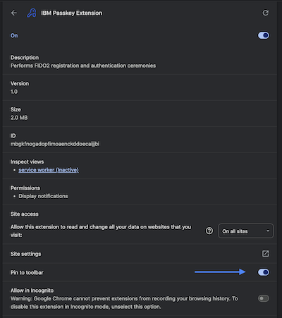

#### Chrome

Once you have successfuly installed the extension on your chrome browser, you should see it listed under the 'All extensions' section.

Click on the `details` button and toggle the option to pin the extension to your chrome toolbar - this will make opening the sidebar easier by clicking on the icon.

Open the side panel to view by clicking on the extensions icon in your google chrome toolbar.

#### Firefox

On firefox, navigate to `about:debugging` and click on **This Firefox** on the left side of the webpage.

Then click on the extensions icon in the firefox toolbar and pin the IBM passkey extension to your toolbar.

Now you an toggle to the sidebar by clicking the icon in your toolbar.

#### Interacting with the Side Panel

Once the side panel is open, you will see the `FIDO2 Config` button.

Click this button to display the FIDO2 config object.

The FIDO2 config object contains attestation keys for various attestation types that the extension supports. This configuration allows you to manage the different key pairs used in FIDO2 operations.

You can modify various parameters within the FIDO2 config object. After making your changes, click the `Update` button located below the FIDO2 object.

This action will update the FIDO2 object with your new values. Upon successful update, a success message will be displayed.

#### Creating a Passkey

Navigate to a webpage that supports WebAuthn registration and authentication ceremonies such as:

- [WebAuthn.io](https://webauthn.io/)
- [webauthn.dodo.dev](https://webauthn.dodo.dev/passwordless)
- [token2](https://www.token2.com/tools/fido2-demo)

Additionally, if you have access to w3id on IBM Security Verify, you can test the extension against a [demonstration site](https://fidointerop.securitypoc.com/) managed by IBMer, Shane Weeden.

Look for the `Register` button on the demo site. Click on it to initiate the creation of a passkey credential.

When prompted, you will see a user presence modal asking you to confirm the registration. Click **Yes** to proceed with creating the passkey.

Congratulations! You have created your first FIDO2 Passkey credential with the IBM Passkey Extension!

After successfully creating a passkey, you can use it for authentication.

#### Authentication

This process may differ depending on the demo site you're using. Some may support multiple credentials with data persistence, while others may be simpler without it.

Locate the credential you created during the registration step if required. Otherwise, directly click the **Authenticate** button after registering a passkey to test the extension's authentication capabilities.

A confirmation modal will appear, asking whether you'd like to proceed with the authentication attempt.

Click `Yes`.

You should see a success modal indicating that the extension's authentication method was successful.

Congratulations! You've now successfully registered and authenticated a FIDO2 passkey using the IBM Passkey Extension!

#### Export/Import

_Supported on relying parties that allow multiple registrations, such as the [demonstration site](https://fidointerop.securitypoc.com/) used in this quickstart guide_.

You can export your credential via the sidebar if you haven't done so already, and then try switching to a different browser (e.g., from Chrome to Firefox) to test the export/import feature. This feature enables recovery of a registration from a credential ID and CA certificate.

After clicking the `FIDO2 Config` button in the side panel, you will see the `Export` button at the bottom of the side panel window.

Click `Yes` when prompted to export your credential.

Choose a location on your local machine to save your credential.

In a different browser, load the extension, navigate to fidointerop.com and open the Registrations page.

Open the side panel and click the Import button to load the credential exported in the previous step.

Keep in mind that new attestation keys are created with every install of the extension, which is why you exported the credential earlier.
Once imported, click the Update button to save your changes.

Locate the Authenticate button for the credential you created in the previous section and test it.

Awesome! You've now demonstrated a cross-browser registration.
